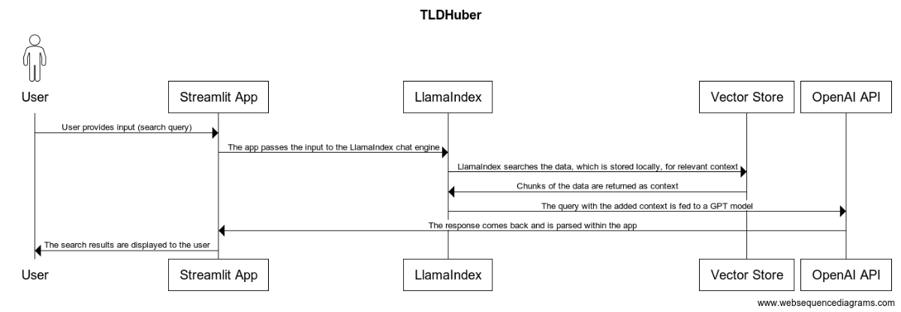

# Component Specification

Our web application breaks down into a front end and a back end, consisting of three main components:

1. Streamlit (front end)
2. LlamaIndex (back end for context fetching)
3. OpenAI API (back end for LLM service)

Breakdowns of the components are given in the following sections.

## LlamaIndex

LlamaIndex plays two roles in our software. It loads the data into a vector store, and then retrieves chunks of that data from the store based on user input to generate an enhanced prompt.

### Data Ingestion Pipeline

The Data Ingestion pipeline is an customizable pipeline using LlamaIndex `readers` and other `transformations` to load our dataset, which is in JSON, into vectorized documents and nodes. 

**Input:** Our podcast dataset in JSON.

**Output:** One or more `vector stores` for use in context searching. 

### Query Engine

The `QueryEngine` takes user input, enhances it with context fetched by its `retriever`, and then uses the enhanced input to get a response from our LLM backend. It is configured with a number of parameters including a `system prompt`, a `response mode`, and more.

**Input:** A user prompt.

**Output:** A response from the LLM that draws on fetched context

## OpenAI API

The OpenAI API is the LLM backend that powers our RAG search. We plan to interact with from our query engine using a `Pydantic Program` which is an abstracted function that uses an OpenAI GPT model as the underlying algorithm. By taking this approach, we can expect to receive structured output. 

**Input:** An enhanced user prompt from the query engine.
**Output:** A `Pydantic Object` containing query results. 

## Streamlit

Streamlit is our web framework of choice and the means by which we will deploy our application. It allows for a simple UI with strong integration with LlamaIndex. 

**Input:** User input, user UI interactions.

**Output:** Displays of LLM responses, UI updates.

## Sequence Diagram

Below is a sequence diagram showing a sample usage of our application. We note that the data ingestion component of our system is omitted in this diagram. This is because we plan to pre-ingest the data, and include the ingested data directly in our application. 

## Use cases

## User Stories and Use Cases

### User Story 1 (Alice):
- Streamlit provides a webpage for Alice to input a query and submit it for processing.
- LlamaIndex's Query Engine processes Alice's keyword input, retrieves relevant context, and sends an enhanced prompt to the OpenAI API.
- OpenAI API generates responses based on the enhanced prompt, providing Alice with a list of Huberman Lab podcasts containing the keywords. Timestamps of discussions are displayed.
- Streamlit handles Alice's input through the UI, displays search results, and allows her to interact further (e.g., clicking for more results, watch the video).

### User Story 2 (Bob):
- Similar to Alice, Streamlit provides a webpage for Bob to input a query and submit it for processing.
- Bob's input is processed by LlamaIndex (here the IndexRouter will potentially send his query to a different set of indexed data optimized for summaries vs keywords) and sent to the OpenAI API for summarization.
- OpenAI API generates a summary of the podcast based on Bob's input.
- Streamlit presents Bob with a concise summary of the podcast, allows for interaction to elaborate on the summary, and displays cited sources and guest names.
